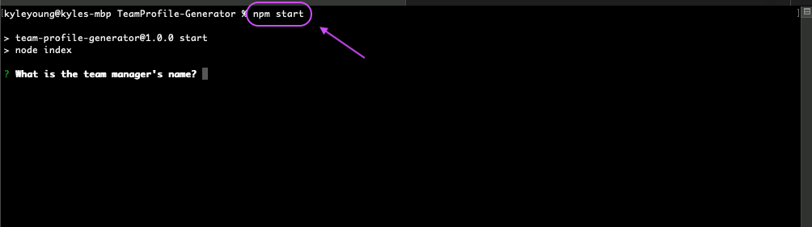
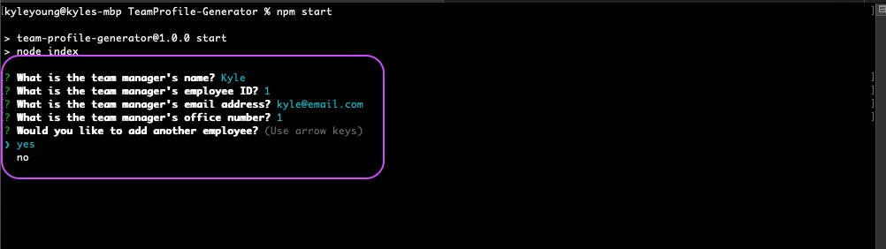
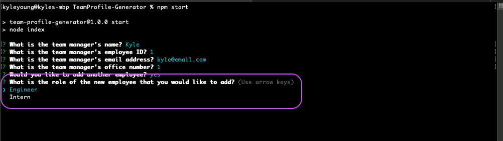
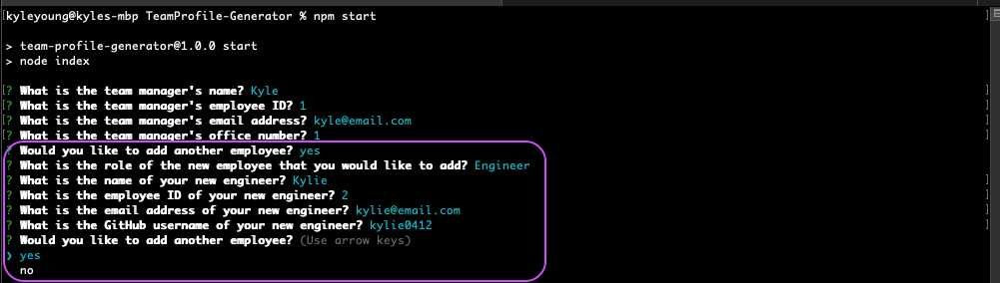
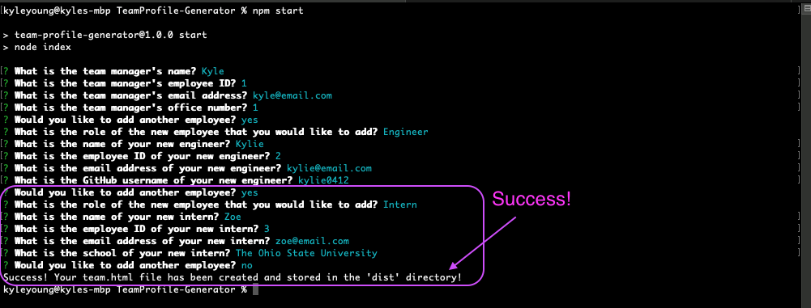

# TeamProfile-Generator

Week 10 HW (OSU Full-Stack Bootcamp)

## Description

#### Technologies Used

    - Javascript
    - NodeJS
    - npm Inquirer

## Table of Contents

- [Screenshots](#screenshots)
- [Installation](#installation)
- [Usage](#usage)
- [Contribute](#contribute)
- [Questions](#questions)
- [License](#license)

## Screenshots

Run 'npm start' to initiate the app with prompts

Manager prompts

Choose a role after choosing 'yes' to adding a new employee

Engineer prompts

Intern prompts with 'Success!' message when finished

If you would like to see a video of how the ReadMe-Generator works then click the link below

[How to video](https://drive.google.com/file/d/1MRTMD_sLVMWP1SOXn1e8swccoh0zE1QM/view)

## Installation

Using the terminal, clone the repository to your local device using SSH or HTTPS. Once cloned, open repository in a text editor to make changes.

## Contribute

Please refer to [Contributor Covenant](https://www.contributor-covenant.org/version/2/0/code_of_conduct/) for contribution guidelines

## Questions

Created by: [Youngin9210](https://github.com/Youngin9210)

For any further information or questions please contact me at [kyleyoung.9210@gmail.com](mailto:kyleyoung.9210@gmail.com)
